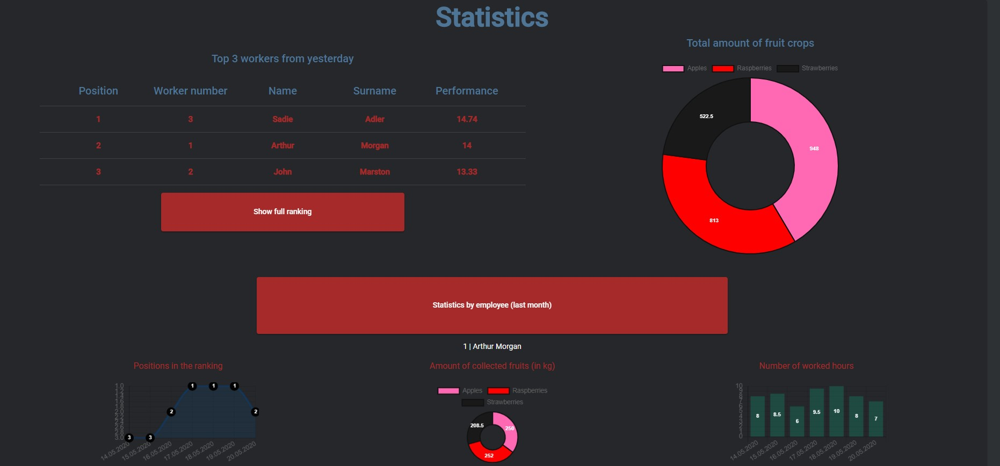

# iWorker

iWorker is an **Angular 9 + ASP.NET Core 3.1** web application for workers management.

## Description
The app provides a couple of possibilities to manage a fruit collectors workers.

**iWorker** provides panels for both, **employer** and **employee**
#### Employer features:
* **Dashboard**, where employer can see the most important informations of work like statistics etc.
* **Messages**, where employer can write messages to employees and read messages from them
* **Workers**, where employer can manage employees, add new employeess, delete them etc.
* **Statistics**, where are shown statistics data of work such as amount of fruit harvest, employees ranking, etc.
* **Raports**, where employer can view raports written by employees
* **Work plan**, where employer can create plan of work for employees

#### Employee features:
* **Dashboard**, where employee can see things like plan for tomorrow, basic statistics etc.
* **Raports** list, where employee can view his raports.
* **New raport**, where employee can add a raport of his work.
* **Plan**, where employe can view a plan of work for selected day.
* **Statistics**, where are shown more specific statistics of his work
* **Messages**, where worker can read messages from employer or write messages to him.
#### Logging into the system
Every user has a unique *ID* number that can be used to log in to the system. By default there is only *ID* and *password* of employer (*ID*: **0**, *Password*: **admin**), employer may change his password after log in and he can add employees to the system.

## Installation
You need to have **Node.js** and **npm** installed on your PC/Mac.

Then just run `npm install` in the project's root.

#### IMPORTANT!
>**You also need to have installed and runned [API](https://github.com/TomWia9/iWorker-ASP.NET-CORE) which supports system funcionality.
You should download it from my [repository](https://github.com/TomWia9/iWorker-ASP.NET-CORE)**
## Development server
Run npm start for a dev server. Navigate to `http://localhost:4200/`. The app will automatically reload if you change any of the source files.

## Build

Run `npm run build` to build the project. The build artifacts will be stored in the dist/ directory. Use the -prod flag for a production build.

# Screenshots

  
Click to expand!

  
  #### Adding a new report
  
  
  #### Employee Dashboard
  

  #### Employer Dashboard
  
  
  #### Workers management
  
  
  #### Statistics
  
  

## License
[MIT](https://choosealicense.com/licenses/mit)
